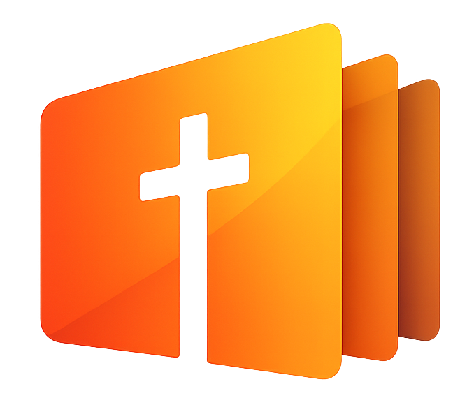
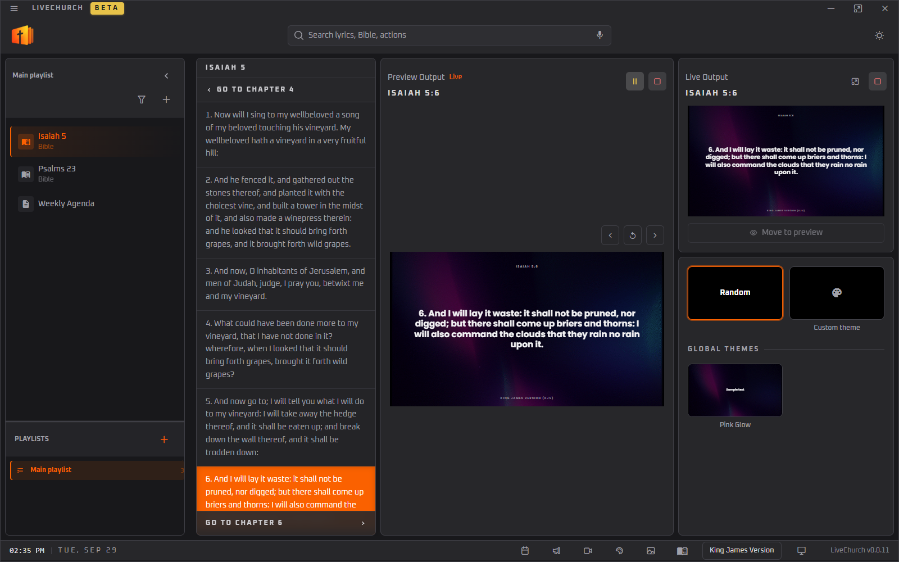
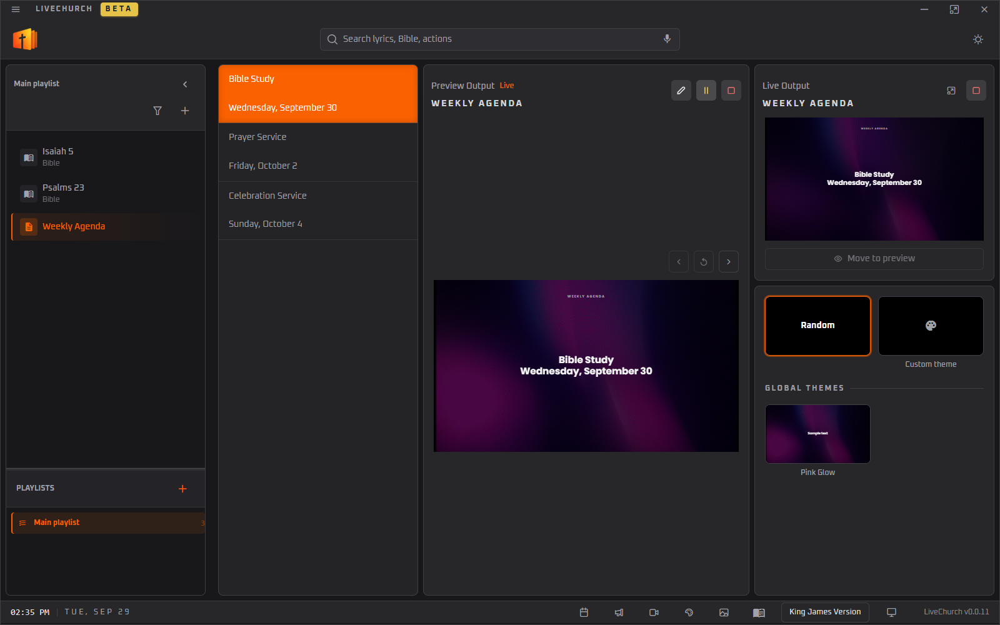
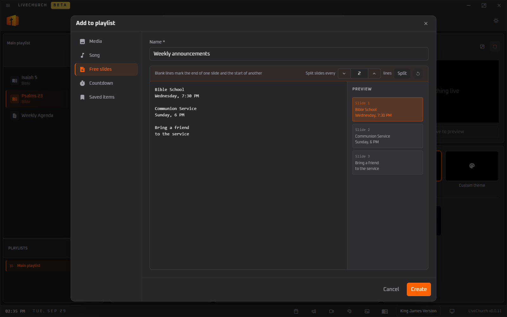
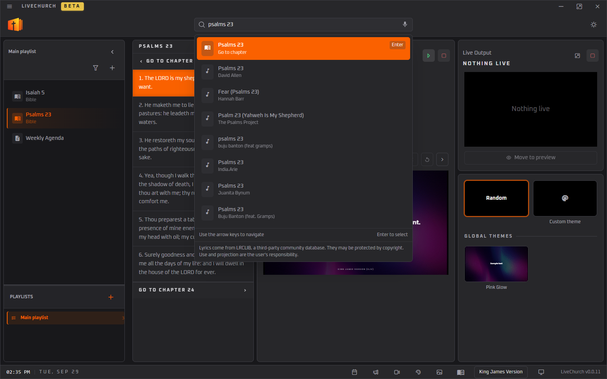
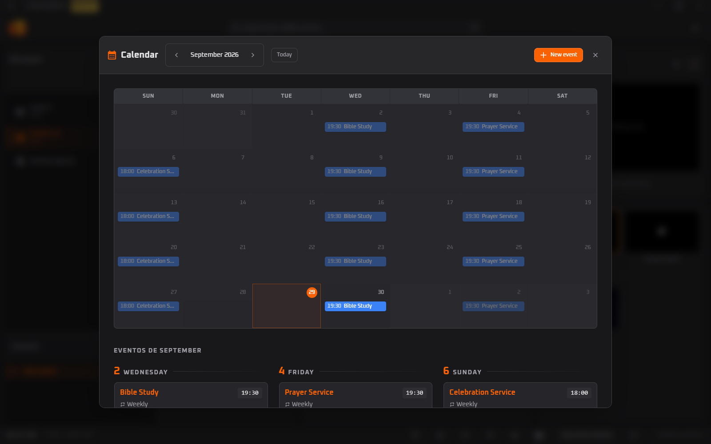
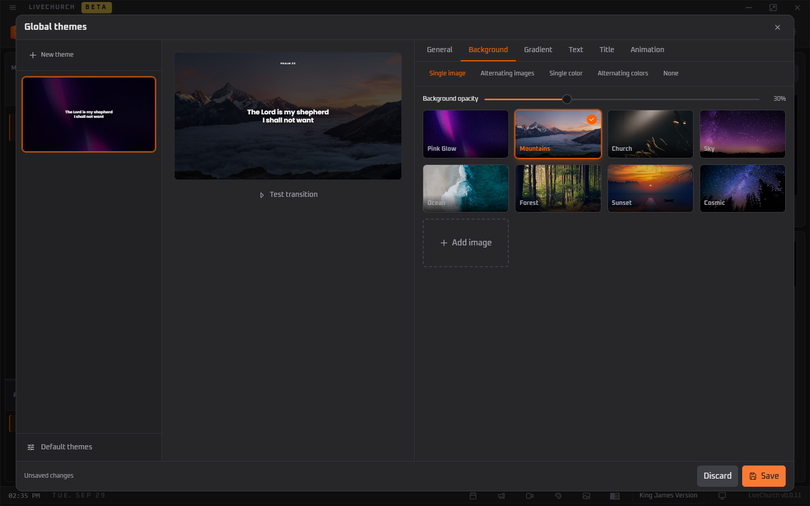
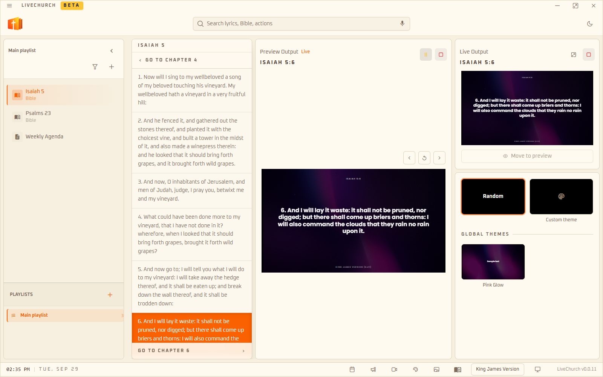

<div align="center">



# LiveChurch

**Free, open-source projection control for churches.**

Bible, hymns, lyrics, agenda, slides and themes: all in one desktop app.

[Website](https://livechurch.github.io/livechurch/) · [Download](https://github.com/LiveChurch/livechurch/releases) · [License](#license)



</div>

---

## Features

**Search everything from one bar**
- Song lyrics for any song, split into slides automatically (needs internet).
- Type `john 3:16` to jump straight to a verse.
- Type `create` or `events` to open announcements or generate the schedule.

**Bible**
- Free-of-copyright translations built in (KJV, WEB and ASV in English, plus Portuguese and Spanish options).
- Works fully offline.
- Browse chapter by chapter without leaving the slide.
- Import your own Bible files.

**Slides and themes**
- Themes with image or animated backgrounds, fonts, gradients, transitions and effects.
- Switch themes with one click, or let the app pick a random one.
- Free-form slides from any text: a blank line separates one slide from the next, with an instant preview.
- Announcement templates with fields like `#Name`.
- Full-screen images and videos.
 
**Run the service**
- Service playlists with songs, verses, announcements, images and videos, saved locally.
- Preview the slide before sending it live, with the live slide shown next to it.
- Projection on a big screen or projector: pick the monitor and control everything from the main window.
- Quick edit with `Ctrl+E` to fix a lyric or text during the service.

**Schedule**
- One-off, weekly and monthly events.
- Generate an events slide for this week, next week or this month.

**Extras**
- Voice search powered by an on-device Whisper model.
- Light and dark mode.
- English, Portuguese (Brazil) and Spanish interface.
- Built-in automatic updates.
- Runs on Windows and Linux.

## Keyboard shortcuts

Everything is designed to be operated from the keyboard during a service. You can also see the full list inside the app (menu → *Keyboard shortcuts*).

### Quick Bible shortcut (overlay)

On the control screen, just start typing (while no text field or modal is focused) and the quick shortcut overlay opens. It jumps to a Bible verse (or a Harpa hymn) without touching the mouse.

| Keys | Action |
| --- | --- |
| Start typing, e.g. `jn 3 16` | Opens the overlay with the book, chapter and verse. Hymns can be opened by number or name. |
| `Shift` `Shift` | Opens the overlay at the chapter currently shown in the preview. |
| `Enter` | Adds the verse to the playlist. |
| `Ctrl` + `Enter` | Adds the verse to the playlist and presents it live. |
| `Esc` | Cancels. |

If the chapter or verse does not exist, the overlay tells you before adding anything.

### General

| Keys | Action |
| --- | --- |
| `Ctrl` + `A` | Presents live what is in the preview. |
| `↑` / `↓` | Previous / next slide (in the slides list). |
| `Ctrl` + `E` | Quick edit the slides text. |
| `Ctrl` + `S` | Saves the slides text in the editors. |
| `Ctrl` + `Enter` | Shows the notice (in multi-line notices), or adds the selected search result and presents it live. |
| `Enter` (in search) | Adds the selected result to the playlist. |

## Screenshots

| Agenda | Free slides |
| :---: | :---: |
|  |  |
| **Search** | **Calendar** |
|  |  |
| **Themes** | **Light mode** |
|  |  |

## Download

Grab the latest installer for your platform from the
[releases page](https://github.com/LiveChurch/livechurch/releases):

- **Windows**: `livechurch-setup-<version>-win32-x64.exe`
- **Linux**: `livechurch-setup-<version>-linux-x64.AppImage`

Or visit the [website](https://livechurch.github.io/livechurch/) for a guided download. The app updates itself after installation.

## Run from source

Requirements: [Bun](https://bun.sh) and Node.js.

```bash
git clone https://github.com/LiveChurch/livechurch.git
cd livechurch
bun install
```

Start the desktop app in development mode:

```bash
bun run dev
```

Other useful scripts:

```bash
bun run dev:web   # UI only, in the browser
bun run check     # type checking
bun run build     # production build
```

## Built with

**Desktop app**

- [Electron](https://www.electronjs.org/) for the desktop shell, packaged with electron-builder
- [Vue 3](https://vuejs.org/) with `<script setup>` and [TypeScript](https://www.typescriptlang.org/)
- [Vite](https://vite.dev/) as the build tool
- [Pinia](https://pinia.vuejs.org/) for shared state
- [PrimeVue 4](https://primevue.org/) for UI components
- [Tailwind CSS v4](https://tailwindcss.com/) for styling
- [Dexie](https://dexie.org/) (IndexedDB) for the local database
- [vue-i18n](https://vue-i18n.intlify.dev/) for translations
- [Transformers.js](https://huggingface.co/docs/transformers.js) (Whisper) for on-device speech recognition
- [date-fns](https://date-fns.org/), [lodash](https://lodash.com/) and [vue-draggable-plus](https://alfred-skyblue.github.io/vue-draggable-plus/)
- [Bun](https://bun.sh) for scripts and package management

**Landing page**

- [Next.js](https://nextjs.org/) with [React](https://react.dev/) and Tailwind CSS, deployed on Vercel

## Contributing

Contributions are welcome! Pull requests are more than welcome, whether it is a bug fix, a new feature, a translation or an improvement to the docs.

1. Fork the repository and create a branch for your change.
2. Follow the code conventions described in [CONVENTIONS.md](CONVENTIONS.md) and run `bun run check` before opening the pull request.
3. Open a pull request describing what changed and why.

Found a bug or have an idea? [Open an issue](https://github.com/LiveChurch/livechurch/issues). By contributing, you agree that your contribution is licensed under the [project license](#license).

## Content and copyright

### Bibles

**Only Bible translations that are free of copyright are available in LiveChurch**: public domain works or texts released under open licenses (for example Almeida Revista e Corrigida 1911, King James Version and Bíblia Livre under CC BY 3.0 BR). Copyrighted translations are not, and will not be, bundled with the project.

Users may import their own Bible files. In that case, the user is solely responsible for making sure they hold the rights to use and project that text.

### Lyrics

Song lyrics are provided by [LRCLIB](https://lrclib.net), a free and open lyrics database. LiveChurch does not host, own or claim any rights over these lyrics; they are fetched on demand from the LRCLIB API. All lyrics remain the property of their respective authors and publishers.

## Disclaimer and responsibility

LiveChurch is provided **"as is"**, without warranty of any kind. The authors are not liable for any damages or losses arising from its use.

**You are responsible for the content you project.** This includes verifying that you have the necessary licenses to display lyrics, images, videos, imported Bibles or any other material during your services and broadcasts (for example, through licensing services such as CCLI, where applicable). Third-party content retrieved through the app, such as lyrics from LRCLIB or photos from Unsplash, is subject to the terms of its own provider.

## License

LiveChurch is distributed under the **LiveChurch Non-Commercial Copyleft License (LC-NCCL)**. In short:

- **Free for personal, church and other non-commercial use.**
- **If you modify the code, you are required to keep it open source.** Any modified version that you distribute, publish, or make available to others must have its complete source code published publicly, under this same license.
- **Modifications are for non-commercial use only.** You may not sell, sublicense, or offer the software, or derivatives of it, as a paid product or service without prior written permission from the copyright holder.
- The copyright notice and this license must be preserved in all copies.

The full text is in the [LICENSE](LICENSE) file. Because this license restricts commercial use, it is not an OSI-approved "open source" license, but the source code is fully public and must stay public.

---

<div align="center">

Made with care for the Church. Visit [livechurch.github.io/livechurch](https://livechurch.github.io/livechurch/)

</div>
